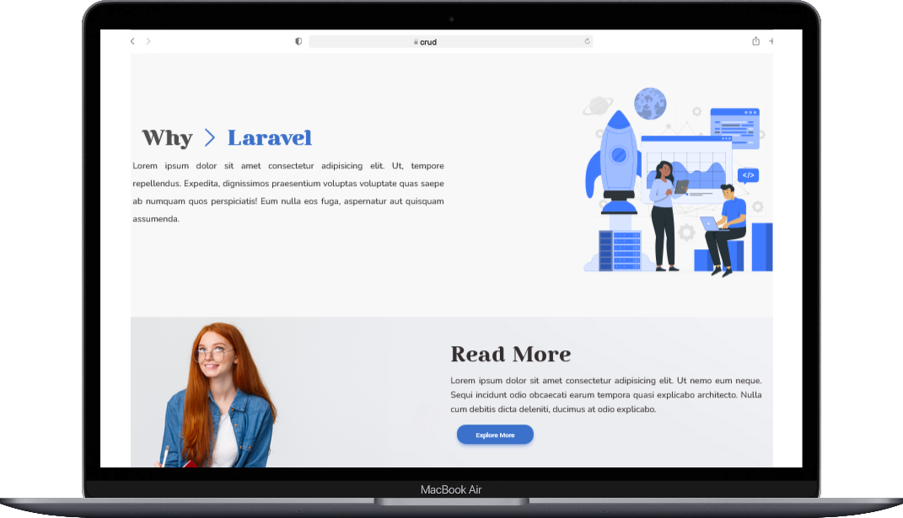

 
 


 #### Requirements :
-  **Web Server** Apcahe 
-  **Laravel Server** ` php artisan serve `
## Command for npm :
-  **Run Dev** ` npm run dev `
-  **View Changes** ` npm run watch `
## API REQUEST CRU: CREATE ,READ , UPDATE 
| ROUTE | Description |API Mehod |
|   -   |      -      |   -      |
|localhost/posts| show all post | GET |
|localhost/posts/id/edit| update specific post |  POST |
|localhost/posts/create| Create post | PUT |


## TEST
* run this command

```bash
./vendor/bin/phpunit
```